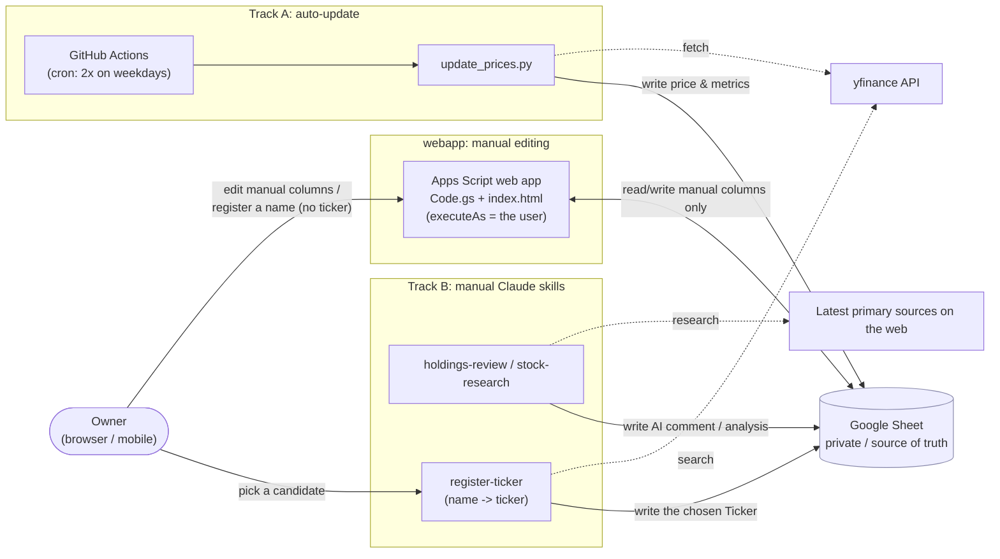
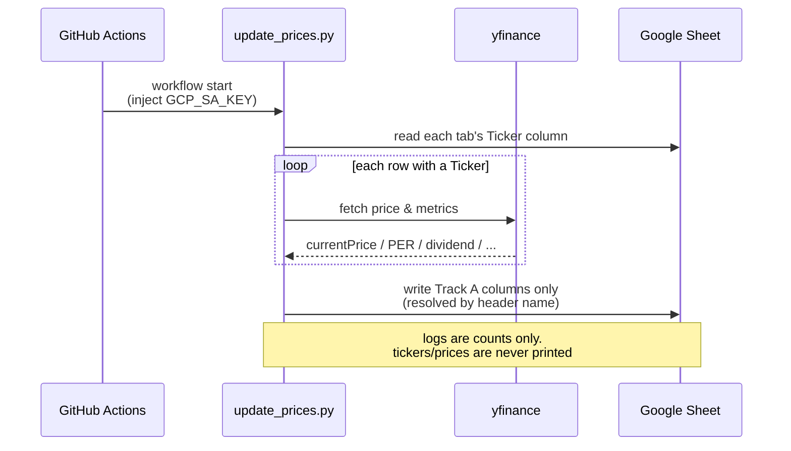
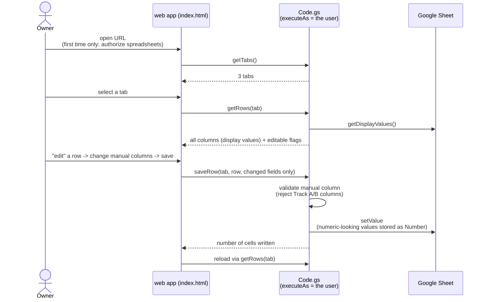

# stock-price-sheet

A repository for managing **held stocks** and **watchlist stocks** in a private Google
Spreadsheet — auto-updating prices and metrics, and writing per-stock advisory comments
by Claude. Prices and dividends are fetched with
[yfinance](https://github.com/ranaroussi/yfinance), so both Japanese stocks (`7203.T`)
and US stocks (`AAPL`) are supported. The auto-update runs on GitHub's runners, so you
do not need to keep your own machine on. It also ships an Apps Script web app for
editing the manual columns from a browser (mobile-friendly).

> The sheet is the **single source of truth**. Real tickers, prices, and PII exist
> **only inside the sheet** and are never committed to the repo (see
> [Security policy](#security-policy)).

## Overview

It processes the two tab types listed under `tabs` in `config.yaml`.

- **holdings (`保有銘柄`)** — stocks the owner actually holds.
- **watchlist (`監視-JP` / `監視-US`)** — stocks not yet held but under consideration.

The `売買履歴` (trade history) tab is never read or written by any code path.

Each tab has three update routes.

| Route | Owner | Columns written |
|-------|-------|-----------------|
| **Track A** (auto) | `update_prices.py` (GitHub Actions / yfinance, no AI) | price, dividend, PER/PBR, market cap, EPS, rating, next earnings date, YTD-low gap, kabutan URL, timestamp, etc. |
| **Track B** (manual) | Claude skills (`holdings-review` / `stock-research`) | `AIコメント`・`AIのおすすめナンピン株価` (holdings) / `業界やテーマ`・`業界PER`・`業界PBR`・`アナリスト予想株価`・`理論株価`・`AI分析コメント`・`AI予想押し目` (watchlists) / 機関別`目標株価（…）`×8 (all tabs) |
| **webapp** (manual) | Apps Script web app (`webapp/`) | **manual columns only** (Track A / Track B columns are read-only) |

Columns are mapped **by header name, not by position** (see each tab's `columns` map in
`config.yaml`), so adding or reordering columns never breaks the mapping. Only
**renaming or removing** a header has an effect.

## Architecture



## Data layout

Columns are classified by owner (who updates them). Manual columns are human-edited and
never overwritten by any code path.

### holdings tab (`保有銘柄`)

| Header | Owner | Meaning |
|--------|-------|---------|
| 銘柄名 / 目標売却株価 / 取得株価 / 取得株数 / 株主優待 / 購入理由 / Ticker / ナンピン検討株価 / ナンピン検討株数 | manual | name, target sell price, cost basis, shares, shareholder benefit, purchase reason, ticker, averaging-down price/shares under consideration |
| 現在株価 / 配当利回り / 配当金 | **Track A** | yfinance (配当金 = per-share dividend × 取得株数) |
| 年初来安値との乖離率 | **Track A** (derived) | (現在株価 − YTD low) / YTD low × 100 (gap above the year-to-date low) |
| AIコメント | **Track B** (holdings-review) | individualized advice using 購入理由 / 目標売却株価 and the Track A figures (target 500–900 chars, structured paragraphs) |
| 目標株価（野村/大和/SMBC日興/みずほ/三菱UFJMS/GS/モルガンS/JPM） | **Track B** (holdings-review) | per-institution analyst targets from public rating coverage, ≤1 year old: `¥2,400 (2026/5)` or `なし` |
| AIのおすすめナンピン株価 | **Track B** (holdings-review) | AI-recommended averaging-down entry price (price only, below cost basis) or `なし` |

### watchlist tabs (`監視-JP` / `監視-US`)

| Owner | Headers |
|-------|---------|
| manual | 銘柄名 / 購入検討株価 / 購入検討理由 / Ticker |
| **Track A** | 現在株価 / 年初来安値との乖離率 / PER / PBR / 配当利回り / 時価総額 / 現在EPS / 年間EPS前年比（%） / レーティング / 次回決算日 / かぶたんURL / 更新時刻 |
| **Track B** (stock-research) | 業界やテーマ / 業界PER / 業界PBR / アナリスト予想株価 / 理論株価 / AI分析コメント / 目標株価（野村/大和/SMBC日興/みずほ/三菱UFJMS/GS/モルガンS/JPM） / AI予想押し目 |

> Track A derived columns: かぶたんURL is generated from the ticker (no fetch);
> 年間EPS前年比（%） from `income_stmt` annual EPS; 年初来安値との乖離率 =
> (現在株価 − YTD low) / YTD low × 100 where the YTD low comes from
> `Ticker.history(period="ytd")["Low"].min()`.

> 時価総額 is normalised to **億円** (non-JPY listings are FX-converted to JPY), with the
> unit unified across the JP and US tabs. Numeric cells carry Google Sheets **display
> formats** and hold the raw (sortable) numbers in the cell.

## Sequence: Track A (auto-update)



## Sequence: webapp (manual editing)



## Sequence: register a stock by name

```mermaid
sequenceDiagram
    actor Owner as Owner
    participant App as web app
    participant GS as Code.gs
    participant Sheet as Google Sheet
    participant RT as register-ticker skill
    participant YF as yfinance search

    Owner->>App: tap "＋ 銘柄を追加", enter 銘柄名 (no ticker)
    App->>GS: addRow(watchlistTab, {銘柄名, ...})
    GS->>Sheet: append a name-only row (Ticker empty)
    Note over Sheet: the row now shows in the app,<br/>waiting for a ticker

    Owner->>RT: run the skill (locally, in Claude Code)
    RT->>Sheet: read-pending (rows with a name but no Ticker)
    loop each pending name
        RT->>YF: search(name)
        YF-->>RT: candidates {symbol, name, exchange}
        RT->>Owner: present the shortlist
        Owner-->>RT: pick one (never auto-picked)
    end
    RT->>Sheet: write-ticker (Ticker column only)
    Note over Sheet: Track A then fills the metrics<br/>on its next run; stock-research<br/>fills the Track B columns
```

## Setup

### 1. Prepare the Google Spreadsheet

- Create the tabs listed in `config.yaml`. The defaults are `保有銘柄` (holdings) and
  `監視-JP` / `監視-US` (watchlist). Put the Japanese header labels from the `columns`
  map in row 1 of each tab. **Order does not matter** (the code resolves columns by
  label).
- Enter tickers in each tab's `Ticker` column in **yfinance format**.
  - Japan (TSE): `7203.T`, `9984.T`, ...
  - US: `AAPL`, `MSFT`, ...
- Fill in the manual columns yourself. Track A fills the price/metric columns,
  holdings-review fills `AIコメント`, and stock-research fills the watchlist Track B
  columns. Rows without a ticker are skipped.

### 2. Create a Google service account

1. Create (or select) a project in the [Google Cloud Console](https://console.cloud.google.com/).
2. Enable the **Google Sheets API** in that project.
3. Create a **service account** and issue + download a **JSON key**.
4. Note the service-account email (`name@project.iam.gserviceaccount.com`).

### 3. Share the sheet with the service account

- From the spreadsheet's **Share** dialog, add the service-account email with
  **Editor** permission (without it the script cannot write).

### 4. Register the key as a GitHub Actions secret

- Repo → **Settings → Secrets and variables → Actions → New repository secret**
- Name: `GCP_SA_KEY`
- Value: the entire contents of the downloaded JSON key file.

### 5. Configure the sheet mapping

```bash
cp config.example.yaml config.yaml
# Edit config.yaml: set spreadsheet_id. The tabs list (each tab's name, type, and
# role -> Japanese header label map) is already filled in for 保有銘柄 / 監視-JP / 監視-US.
git add config.yaml && git commit -m "configure sheet mapping" && git push
```

`config.yaml` must be committed so the Actions runner can read it. It contains no
secrets and no tickers (`spreadsheet_id` is just the ID from the sheet URL and is safe
to publish).

### 6. Run

- **Actions** tab → **Update stock prices** → **Run workflow** (`workflow_dispatch`) for
  an immediate test.
- After that it runs automatically on schedule.

## webapp (browser editing of manual columns)

`webapp/` is an Apps Script **web app**. It opens the sheet by ID and runs **as the
accessing user**, so no service-account key is needed. Track A / Track B columns are
read-only and the server refuses to write them. On a watchlist tab you can also
**register a stock by name** (the `＋ 銘柄を追加` button): it appends a name-only row,
which the `register-ticker` skill later resolves to a `Ticker`.

For the setup steps (`clasp` install / login, enabling the Apps Script API,
create / push / deploy, access settings) see
**[`webapp/SETUP.md`](webapp/SETUP.md)**. In short:

```bash
cd webapp
npx --yes @google/clasp login          # first time only (the sheet owner's Google account)
npx --yes @google/clasp create --type standalone --title "stock-price-sheet"
git checkout -- appsscript.json        # create overwrites the manifest, so restore it
npx --yes @google/clasp push --force
npx --yes @google/clasp deploy --description "v1"
```

After deploying, in the Apps Script editor's **Manage deployments**, confirm
**Execute as = Me / Who has access = Only myself**. On first access it asks for the
`spreadsheets` scope. `.clasp.json` (scriptId) is gitignored and stays local.

## Local testing

```bash
pip install -r requirements.txt
export GOOGLE_APPLICATION_CREDENTIALS=/path/to/service-account.json
python update_prices.py --dry-run   # fetch + resolve columns only (no writes)
python update_prices.py             # actually write
python -m unittest discover -s tests
```

## Track B (manual research by Claude)

Track B is three Claude Code skills. Open this repo in Claude Code and run whichever you
need. The research skills reference the latest primary sources in a loop and **never
fabricate numbers**.

- **`.claude/skills/holdings-review/`** — for the holdings tab. For each held stock, it
  writes individualized advice to `AIコメント` using your `購入理由` /
  `目標売却株価` and the Track A figures, plus the eight per-institution
  `目標株価（…）` columns (public rating coverage, ≤1 year old, `なし` when absent).
- **`.claude/skills/stock-research/`** — for the watchlist tabs. It researches values
  yfinance cannot provide (industry / theme, industry PER/PBR, analyst-consensus target
  price, theoretical price, the eight per-institution `目標株価（…）` columns) and writes
  them, along with a judgment of whether the `購入検討株価` is a reasonable entry, to
  `AI分析コメント`.
- **`.claude/skills/register-ticker/`** — resolves the `Ticker` for stocks you
  registered **by name** from the web app (a `銘柄名` with no ticker yet). It proposes
  candidates from the yfinance search API, **you pick one** (it never auto-picks), and
  it writes only the chosen `Ticker`; Track A then fills the rest on its next run.

For a numeric cell that cannot be confirmed, put a **minimal reason word** (e.g. `赤字` /
`確認不可`) in one or two words (not a sentence, no date — the research date goes in the
comment body). An empty cell or a fabricated number is not allowed. See each `SKILL.md`
and the project `CLAUDE.md` for research details.

If you change the sheet structure (rename/remove a header or tab), reconcile
`config.yaml` with the `sheet-sync` skill.

## Security policy

This repo is **private**, but committed content and Actions logs are treated as if they
could leak (defense-in-depth; do not relax the rules on the grounds of visibility).

- Never include the owner's **PII** (name, email, address, phone, etc.) anywhere in code,
  config, commit messages, README, docs, or logs.
- **Never put real held/watched tickers anywhere in the repo.** Real tickers live only in
  each tab's `Ticker` column and are never committed. Examples in docs use generic format
  only (`7203.T` / `AAPL`).
- Never print tickers, prices, or PII to **logs**. Debug output is limited to tab names,
  row numbers, and counts. `update_prices.py` logs aggregate counts only.
- The service-account JSON key is injected only via the GitHub secret `GCP_SA_KEY` and is
  never committed (`*.json` is gitignored). `config.yaml` holds only the `spreadsheet_id`
  (safe to publish) and generic header labels.

## Notes

- **Timing is approximate.** GitHub Actions scheduled runs can be delayed 10–30+ minutes
  or skipped under load. Fine for holdings management, not for real-time trading.
- **Schedule is in UTC.** Twice per weekday — 06:00 UTC (15:00 JST, after the TSE close)
  and 22:00 UTC (07:00 JST, after the US close). Adjust the cron for other markets.
- **Auto-disable.** GitHub disables scheduled workflows if there is no commit to the repo
  for 60 days. Push occasionally, or re-enable from the Actions tab.
- **Tickers use yfinance format** (`7203.T`; not `TYO:7203`).
- **Dividend currency.** 配当金 is in the stock's own currency (`*.T` = JPY, US stocks =
  USD). On the mixed-market holdings tab this column mixes currencies (like 現在株価).

## License

Copyright (c) 2026 cmb-sy. **All Rights Reserved.**

This is **proprietary software**, not open source. No license — express or implied — is
granted to use, copy, modify, merge, publish, distribute, sublicense, or sell any part of
it without the copyright holder's prior written permission. Viewing this repository, or
forking it where the hosting platform's terms allow, grants no such right. See the
[`LICENSE`](LICENSE) file for the full terms.

