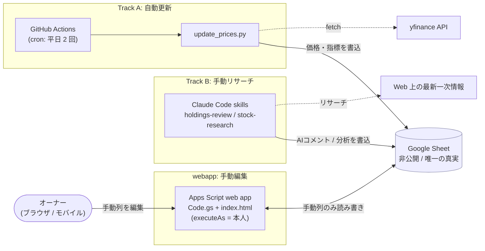
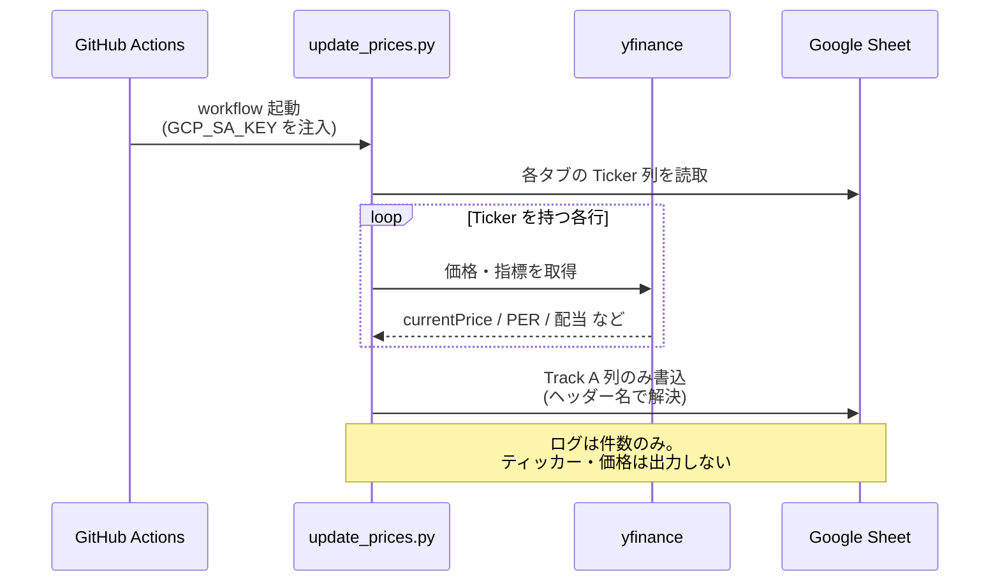
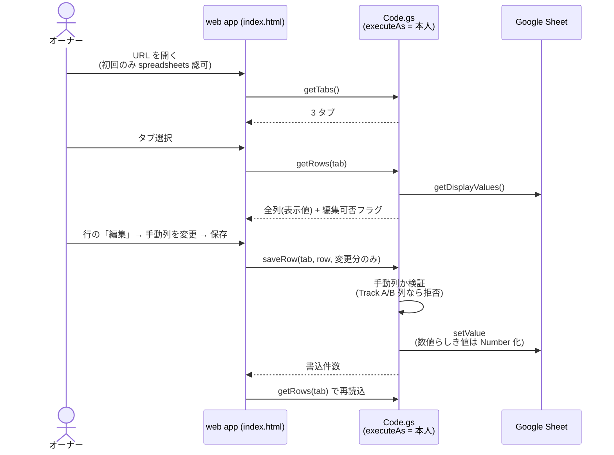

# stock-price-sheet

非公開の Google スプレッドシートで **保有株** と **監視銘柄** を管理し、価格・指標の自動更新と、
Claude による銘柄ごとの助言コメントを書き込むためのリポジトリです。価格・配当は
[yfinance](https://github.com/ranaroussi/yfinance) で取得するため、日本株（`7203.T`）・
米国株（`AAPL`）の両方に対応します。自動更新は GitHub のランナーが実行するので、自前のマシンを
常時起動しておく必要はありません。さらに、手動列をブラウザ（モバイル可）から編集できる
Apps Script の web app を同梱しています。

> このシートは**唯一の真実（source of truth）**です。実ティッカー・価格・PII は
> **シート内にのみ**存在し、リポジトリには一切コミットしません（詳細は[セキュリティ方針](#セキュリティ方針)）。

## 概要

`config.yaml` の `tabs` に列挙された 2 種類のタブを処理します。

- **holdings（`保有銘柄`）** — 実際に保有している銘柄。
- **watchlist（`監視-JP` / `監視-US`）** — まだ保有しておらず購入を検討中の銘柄。

`売買履歴`（取引履歴）タブはどのコードパスからも読み書きしません。

各タブには 3 つの更新経路があります。

| 経路 | 担当 | 書き込む列 |
|------|------|-----------|
| **Track A**（自動） | `update_prices.py`（GitHub Actions / yfinance、AI なし） | 価格・配当・PER/PBR・PEG・時価総額・EPS・52週高安・レーティング・次回決算日・各種乖離率・評価損益・URL・更新時刻 など |
| **Track B**（手動） | Claude skills（`holdings-review` / `stock-research`） | `AIコメント` / `業界やテーマ`・`業界PER`・`業界PBR`・`アナリスト予想株価`・`理論株価`・`AI分析コメント` |
| **webapp**（手動） | Apps Script web app（`webapp/`） | **手動列のみ**（Track A / Track B 列は読み取り専用） |

列は**位置ではなくヘッダー名**でマッピングします（各タブの `config.yaml` の `columns` を参照）。
そのため列の追加・並び替えでは壊れません。ヘッダーの**改名・削除**だけが影響します。

## アーキテクチャ



## データレイアウト

列は owner（更新元）ごとに分類されます。手動列は人間が編集し、どのコードパスも上書きしません。

### holdings タブ（`保有銘柄`）

| ヘッダー | owner | 意味 |
|----------|-------|------|
| 銘柄名 / 取得日 / 短中長期 / 目標売却株価 / 取得株価 / 取得株数 / 購入理由 / Ticker | 手動 | 銘柄名・取得情報・保有方針・目標売却価格・購入理由など |
| 現在株価 / 配当利回り / 配当金 | **Track A** | yfinance（配当金 = 1株配当 × 取得株数） |
| 評価額 / 評価損益額 / 評価損益率（%） | **Track A**（派生） | 現在株価・取得株価・取得株数から計算（評価額 = 現在株価 × 取得株数、評価損益額 = (現在株価 − 取得株価) × 取得株数） |
| 目標との乖離率（%） | **Track A**（派生） | (目標売却株価 − 現在株価) / 現在株価 × 100（目標までの余地） |
| PER / PBR / 次回決算日 | **Track A** | yfinance（次回決算日は `Ticker.calendar`） |
| AIコメント | **Track B**（holdings-review） | 購入理由・保有方針・目標売却価格を踏まえた個別助言（目安 500〜900 字・段落構成） |

### watchlist タブ（`監視-JP` / `監視-US`）

| owner | ヘッダー |
|-------|----------|
| 手動 | 銘柄名 / 購入検討株価 / 購入検討理由 / Ticker |
| **Track A** | かぶたんURL / みんかぶURL / 現在株価 / 購入検討との乖離率（%） / PER / PBR / PEGレシオ / 配当利回り / 時価総額 / 現在EPS / 年間EPS前年比（%） / 52週高値 / 52週安値 / 52週レンジ内位置（%） / レーティング / アナリスト予想乖離率（%） / 次回決算日 / 更新時刻 |
| **Track B**（stock-research） | 業界やテーマ / 業界PER / 業界PBR / アナリスト予想株価 / 理論株価 / AI分析コメント |

> Track A の派生列: みんかぶURL はティッカーから生成（JP=`minkabu.jp/stock/{code}`・US=`us.minkabu.jp/stocks/{TICKER}`）、
> 購入検討との乖離率（%）= (現在株価 − 購入検討株価)/購入検討株価×100、52週レンジ内位置（%）= (現在 − 安値)/(高値 − 安値)×100、
> アナリスト予想乖離率（%）= (アナリスト予想株価 − 現在株価)/現在株価×100（アナリスト予想株価は Track B 値のため、未記入のうちは `N/A`）。

> 時価総額は **億円**に正規化（非 JPY 上場は FX で JPY 換算）し、JP/US タブで単位を統一します。
> 数値セルは Google Sheets の**表示書式**を持ち、セルには生の数値（ソート可能）を保持します。

## シーケンス: Track A（自動更新）



## シーケンス: webapp（手動編集）



## セットアップ

### 1. Google スプレッドシートの準備

- `config.yaml` が列挙するタブを用意する。既定は `保有銘柄`（holdings）・`監視-JP` / `監視-US`
  （watchlist）。各タブの 1 行目に、`columns` マップの日本語ヘッダーラベルを置く。**順番は不問**
  （コードがラベルで列を解決する）。
- 各タブの `Ticker` 列にティッカーを **yfinance 形式**で入力する。
  - 日本（東証）: `7203.T`, `9984.T`, ...
  - 米国: `AAPL`, `MSFT`, ...
- 手動列は自分で埋める。Track A が価格・指標列を、holdings-review が `AIコメント`、stock-research
  が watchlist の Track B 列を埋める。ティッカーのない行はスキップされる。

### 2. Google サービスアカウントの作成

1. [Google Cloud Console](https://console.cloud.google.com/) でプロジェクトを作成（または選択）。
2. そのプロジェクトで **Google Sheets API** を有効化。
3. **サービスアカウント**を作成し、**JSON キー**を発行してダウンロード。
4. サービスアカウントのメールアドレス（`name@project.iam.gserviceaccount.com` 形式）を控える。

### 3. シートをサービスアカウントと共有

- スプレッドシートの **共有** から、サービスアカウントのメールを **編集者** 権限で追加する
  （これがないとスクリプトは書き込めない）。

### 4. キーを GitHub Actions シークレットに登録

- リポジトリ → **Settings → Secrets and variables → Actions → New repository secret**
- 名前: `GCP_SA_KEY`
- 値: ダウンロードした JSON キーファイルの全内容。

### 5. シートマッピングの設定

```bash
cp config.example.yaml config.yaml
# config.yaml を編集: spreadsheet_id を設定する。tabs リスト（各タブの name・type・
# role -> 日本語ヘッダーラベルのマップ）は 保有銘柄 / 監視-JP / 監視-US 用に記入済み。
git add config.yaml && git commit -m "configure sheet mapping" && git push
```

`config.yaml` は Actions ランナーが読めるようコミットが必要。シークレットもティッカーも含まれない
（`spreadsheet_id` はシート URL の ID で、公開しても安全）。

### 6. 実行

- **Actions** タブ → **Update stock prices** → **Run workflow**（`workflow_dispatch`）で即時テスト。
- 以降はスケジュールで自動実行される。

## webapp（手動列のブラウザ編集）

`webapp/` は Apps Script の **web app**。シートを ID で開き、**デプロイした本人として**実行するため
サービスアカウントキーは不要。Track A / Track B 列は読み取り専用で、サーバ側が書き込みを拒否する。

セットアップ手順（`clasp` の install / login、Apps Script API 有効化、create / push / deploy、
アクセス設定）は **[`webapp/SETUP.md`](webapp/SETUP.md)** を参照。要点:

```bash
cd webapp
npx --yes @google/clasp login          # 初回のみ（シート所有者の Google アカウント）
npx --yes @google/clasp create --type standalone --title "stock-price-sheet"
git checkout -- appsscript.json        # create がマニフェストを上書きするため復元
npx --yes @google/clasp push --force
npx --yes @google/clasp deploy --description "v1"
```

デプロイ後、Apps Script エディタの **デプロイを管理** で **実行＝自分 / アクセス＝自分のみ** を確認。
初回アクセス時に `spreadsheets` スコープの認可を求められる。`.clasp.json`（scriptId）は gitignore
済みでローカルに留まる。

## ローカルテスト

```bash
pip install -r requirements.txt
export GOOGLE_APPLICATION_CREDENTIALS=/path/to/service-account.json
python update_prices.py --dry-run   # 取得・列解決のみ（書き込みなし）
python update_prices.py             # 実書き込み
python -m unittest discover -s tests
```

## Track B（Claude による手動リサーチ）

Track B は 2 つの Claude Code skill。このリポジトリを Claude Code で開いて必要な方を実行する。
いずれも最新の一次情報をループで繰り返し調べ、**数値を捏造しない**。

- **`.claude/skills/holdings-review/`** — holdings タブ用。各保有銘柄について、自分の
  `購入理由` / `短中長期` / `目標売却株価` と Track A の数値を踏まえ、個別の助言コメントを
  `AIコメント` に書く。
- **`.claude/skills/stock-research/`** — watchlist タブ用。yfinance では得られない値（業界・テーマ、
  業界 PER/PBR、アナリストのコンセンサス目標株価、理論株価）を調べ、`購入検討株価` が妥当な
  エントリーかの判断とともに `AI分析コメント` に書く。

確認できない数値セルには**最小限の理由語**（例: `赤字` / `確認不可`）を 1〜2 語で入れる
（文章にしない・日付も入れない。リサーチ日付はコメント本文に記録する）。空欄や捏造は不可。
リサーチ詳細は各 `SKILL.md` とプロジェクトの `CLAUDE.md` を参照。

シート構造を変えたら（ヘッダーやタブの改名・削除）、`sheet-sync` skill で `config.yaml` を整合させる。

## セキュリティ方針

このリポジトリは**非公開**だが、コミット内容と Actions ログは漏洩しうるものとして扱う
（多層防御。可視性を理由にルールを緩めない）。

- オーナーの **PII**（氏名・メール・住所・電話番号など）をコード・設定・コミットメッセージ・
  README・ドキュメント・ログのどこにも含めない。
- **保有・監視している実ティッカーをリポジトリのどこにも置かない**。実ティッカーは各タブの
  `Ticker` 列にのみ存在し、コミットしない。ドキュメント中の例は汎用形式（`7203.T` / `AAPL`）のみ。
- **ログ**にはティッカー・価格・PII を出力しない。デバッグ出力はタブ名・行番号・件数に限る。
  `update_prices.py` は集計件数のみをログする。
- サービスアカウント JSON キーは GitHub シークレット `GCP_SA_KEY` 経由でのみ注入し、コミットしない
  （`*.json` は gitignore 済み）。`config.yaml` には `spreadsheet_id`（公開可）と汎用ヘッダーラベルのみ。

## 注意点

- **タイミングは目安**。GitHub Actions のスケジュール実行は 10〜30 分以上遅れたり、負荷時にスキップ
  されることがある。保有管理には十分だが、リアルタイム取引には向かない。
- **スケジュールは UTC**。平日 1 日 2 回 — 06:00 UTC（15:00 JST、東証クローズ後）と
  22:00 UTC（07:00 JST、米国クローズ後）。市場が異なる場合は cron を調整する。
- **自動無効化**。GitHub はリポジトリへのコミットが 60 日ない場合スケジュール workflow を無効化する。
  ときどき push するか、Actions タブから再有効化する。
- **ティッカーは yfinance 形式**（`7203.T`。`TYO:7203` は不可）。
- **配当金の通貨**。配当金は銘柄自身の通貨建て（`*.T` は JPY、米国株は USD）。市場混在の holdings
  タブではこの列も通貨が混在する（現在株価と同様）。
```